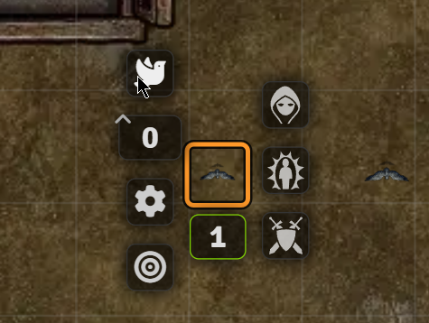
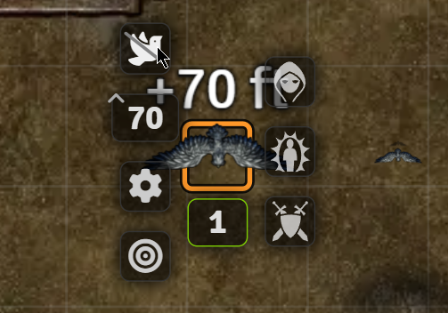
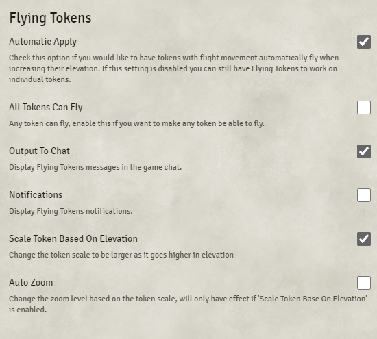

   
   
 

# Flying Tokens

Ever wanted your tokens to fly? I mean really look like they're flying, when they are supposed to, well you should try Flying Tokens.
Flying Tokens works with Token Magic FX API to add shadow and movement that simulates the flight.

## Functions

With the **Automatic Apply** enabled you just have to change the token elevation and it will do all the magic. The module first check if the character has flight movement, otherwise it won't apply the effect.  
When you change the elevation to 0 the token will land.

If you opt to disable the automatic effect and prefer to enable per token you just have to disable **Automatic Apply** in the settings and now all tokens with flying speed movement will have a dove icon in the token HUD, if you click on it, it activates ***Flying Tokens*** for that specific token and then when you change its elevation the effects will apply.

#### First click the dove icon to activate *Flying Tokens* for that token and then set a new elevation

#### If you want to disable just click the dove slashed icon and it will remove the filter effects, then you can change the elevation and it won't apply effects anymore.

### Effects included
Shadow projection, token scale up or down depending on the altitude, small movements to simulate flight, Token Magic FX filter to simulate wind. In the next release it will be configurable.

## Settings
**Automatic Apply**
*Default: active.*  
This setting if checked will apply ***Flying Tokens*** effects to all tokens that have flying speed movement and you change its elevation.

**Output to chat**
*Default: active.*  
Display a chat message with the token name and its new elevation.

## Dependencies
- [Token Magic FX](https://foundryvtt.com/packages/tokenmagic)

## Known Issues
So far none.

## Feedback
If you have suggestions or want to report a problem, you can create an issue here: [Issues](../../issues)

## Changelog
### 1.0.0
- Intial release

## Special Thanks
`Peterson` and ``Zhell``

## Donations
The module is totally free and will remain this way.  
I am unemployed, though. So every little help counts.

## Attributions
--
